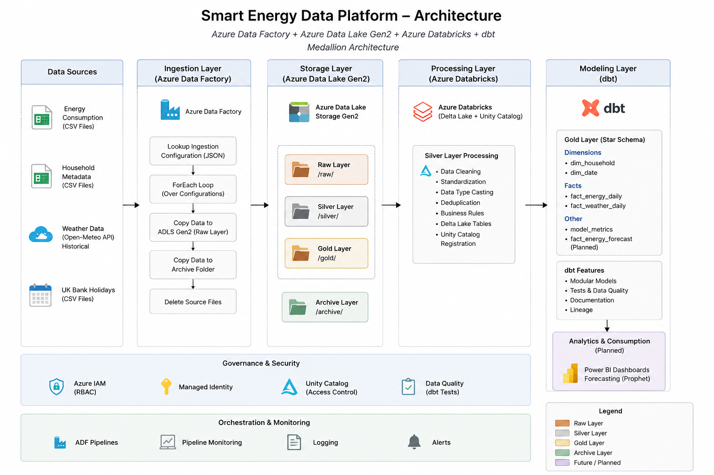

# Smart Energy Data Platform

This project is an end-to-end Azure Data Engineering solution built using Azure Data Factory, Azure Data Lake Storage Gen2, Azure Databricks, and dbt.

The goal of the project is to build a modern Medallion Architecture that ingests smart meter energy data, transforms it into analytics-ready datasets, and prepares it for downstream forecasting and reporting.

---

## Architecture

<p align="center">
  
</p>

---

## Tech Stack

- Azure Data Factory
- Azure Data Lake Storage Gen2
- Azure Databricks
- PySpark
- Delta Lake
- Unity Catalog
- dbt
- Git & GitHub

---

## Data Sources

The project combines multiple datasets:

- Smart meter household energy consumption
- Household metadata
- Historical weather data
- UK bank holidays

---

## Project Structure

```text
adf/            Azure Data Factory artifacts
databricks/     PySpark notebooks
dbt/            Gold models, tests and documentation
screenshots/    Project screenshots
```

---

## Pipeline

### 1. Data Ingestion (Azure Data Factory)

A metadata-driven Azure Data Factory pipeline loads data into the Raw layer.

Current workflow:

- Reads ingestion configuration from JSON
- Iterates through configured datasets
- Copies source files into the Raw layer
- Archives processed files
- Deletes successfully processed source files

*(ADF pipeline screenshot will be added here.)*

---

### 2. Silver Layer (Azure Databricks)

The Silver layer standardizes and cleans the raw datasets before they are used for analytics.

Current transformations include:

- Column standardization
- Data type conversion
- Basic data quality checks
- Delta Lake conversion
- Unity Catalog registration

*(Databricks notebook screenshot will be added here.)*

---

### 3. Gold Layer (dbt)

dbt reads the Silver Delta tables and builds a dimensional model using a Star Schema.

Current models include:

**Dimensions**

- dim_household
- dim_date

**Facts**

- fact_energy_daily
- fact_weather_daily

The project also includes dbt tests, documentation, and model lineage.

*(dbt lineage screenshot will be added here.)*

---

## CI/CD

### Continuous Integration — Implemented

GitHub Actions provides an enforced CI quality gate for changes proposed to `main`.

The workflow runs on pull requests, pushes to `main`, and manual dispatch. It:

- Validates Azure Data Factory JSON artifacts
- Validates YAML configuration
- Validates Jupyter notebook JSON structure when notebooks are tracked
- Compiles Databricks Python notebook exports
- Parses the dbt project with a CI-safe profile
- Scans Git history for exposed secrets with Gitleaks

The protected `main` branch requires a pull request, an up-to-date feature branch, resolved review conversations, and a successful `Validate project artifacts` status check. Branch deletion and force pushes are blocked.

These checks validate repository syntax and structure; they do not execute or deploy the complete ETL pipeline.

### Continuous Delivery — Planned

The planned development CD workflow will use:

- GitHub Actions with Microsoft Entra and Azure Databricks workload identity federation
- Azure Data Factory utilities to validate artifacts and generate ARM templates
- Azure Resource Manager deployment to a development Data Factory
- Databricks Declarative Automation Bundles for development workspace deployment and job execution
- dbt Core execution against an isolated development schema
- Post-deployment validation and a documented recovery or rollback exercise

No cloud deployment workflow has been implemented or validated yet.

---

## Current Status

### Completed

- ✅ Metadata-driven Azure Data Factory pipeline
- ✅ Raw, Silver and Gold architecture
- ✅ Azure Databricks transformations
- ✅ Delta Lake implementation
- ✅ Unity Catalog integration
- ✅ dbt Gold models
- ✅ dbt tests
- ✅ dbt documentation
- ✅ GitHub Actions CI validation and protected-branch quality gate

### Planned

- Watermark-based incremental ingestion
- Weather enrichment
- Forecasting using Prophet
- Power BI dashboard
- Performance optimization
- Development CD for ADF, Databricks and dbt

---

## Repository

```text
adf/            Data ingestion
databricks/     Silver layer transformations
dbt/            Gold layer models
screenshots/    Documentation images
```

---

## Notes

This repository focuses on the engineering implementation rather than the datasets themselves. Public datasets are used for learning and portfolio purposes.
